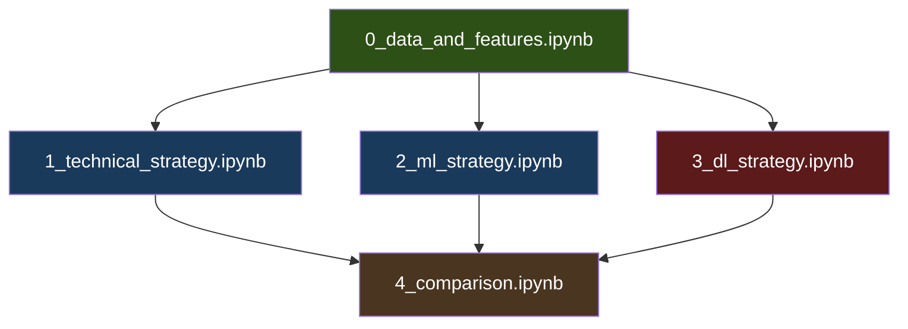

# Multi-Asset Trading Strategy Simulation System — Implementation Plan

## Goal

Build a modular, function-based Python system (5 Jupyter Notebooks) that fetches historical data for 20 assets across 4 classes, generates BUY/SELL/HOLD signals via 3 strategy families (technical indicators, ML, DL), backtests each strategy with realistic constraints, and compares performance. All assets trade in USD with live INR→USD conversion for Indian stocks.

---

## Currency Handling

**All trading in USD. Indian stock prices converted using historical INR→USD rates.**

- Fetch `USDINR=X` from yfinance for full 2019-2024 range, store as `data/usdinr.parquet`
- Create a complete calendar date index (every day), reindex, and **forward-fill** all gaps
- Forward-fill guarantees: holidays → use previous day's rate, weekends → use Friday's rate
- Indian stock prices are stored in INR in their raw Parquet files
- At trade time: `price_usd = price_inr / usdinr_rate[trade_date]`
- Since we forward-fill the complete calendar, **there is never a missing rate** — the last known rate is always the valid rate until markets reopen

---

## Answers to All Design Questions

### 9.1 Position Sizing → **ATR-based dynamic sizing**

- **Decision**: Risk 2% of the asset's allocated capital per trade. Stop-loss distance = `2 × ATR(14)`. Position size = `risk_amount / stop_loss_distance`.
- **Why not fixed sizing?** Fixed sizing ignores volatility — you'd risk far more on BTC than on a blue-chip stock. ATR normalizes risk across assets automatically.

### 9.2 Indicator Signal Combination → **Weighted voting with majority threshold**

- **Decision**: Each indicator casts a vote (+1 BUY, -1 SELL, 0 HOLD) with these weights:
  | Indicator | Weight | Rationale |
  |-----------|--------|-----------|
  | EMA crossover (20/50) | 2 | Primary trend signal — trend-following is the most persistent, well-documented alpha source across asset classes (Moskowitz et al. 2012) |
  | RSI(14) | 1.5 | Second most reliable factor — captures momentum/mean-reversion. More false signals in strong trends, so ranks below EMA |
  | Bollinger Bands | 1 | Volatility extremes — useful but produces frequent false breakouts in ranging markets |
  | OBV trend | 1 | Volume confirmation — supporting evidence, noisy on its own |
- Composite score = weighted sum. Thresholds: **BUY if score ≥ 3, SELL if score ≤ -3, else HOLD**.
- **Why not ML-based combination?** That would make the "technical" strategy just another ML strategy. Rule-based is the whole point of this baseline.
- **Note**: These weights are starting heuristics validated by backtest results. Equal-weight (all 1) will also be tested as a sanity check.

### 9.3 ML/DL Training → **Sliding window walk-forward, retrain every 60 trading days**

- **Decision**: 
  - Training window: **750 trading days** (~3 years) for ML, **500 days** (~2 years) for DL.
  - Retrain every **60 trading days** (~3 months).
  - Use **Optuna** (20 trials per retrain cycle) for ML hyperparameter tuning. DL uses fixed architecture with learning rate scheduling.
- **Why sliding, not expanding?** Financial markets are non-stationary — 2019 data is largely irrelevant to 2024 behavior. Sliding windows adapt to regime changes.
- **Why 60 days?** Too frequent (20 days) → only 20 new data points, model barely changes, wastes compute. Too infrequent (250 days) → model becomes stale, misses regime shifts. 60 days (~1 quarter) aligns with earnings cycles and balances freshness vs. stability.
- **Overfitting prevention**: Early stopping on validation fold, regularization (L2 for DL, `min_child_samples` for LightGBM), dropout=0.3 for LSTM.

### 9.4 Model Scaling (20 assets × 2 trainable strategies) → **Per-asset models, sequential processing**

- **Decision**: 20 assets × 2 trainable strategies (ML + DL) = **40 models**. Technical strategy has no training.
  - **Per-asset models, not one global model.** BTC-USD and JNJ have fundamentally different dynamics (volatility, trading hours, drivers). A global model with "ticker" as a feature would learn average behavior — mediocre for everything. With only ~750 training days per asset, there's insufficient data for the model to condition on a categorical ticker feature. Per-asset models are specialized and debuggable.
  - ML models: **Train sequentially** per asset. LightGBM trains in seconds per asset — no bottleneck.
  - DL models: **Train sequentially** on auto-selected GPU. Each LSTM trains in ~2-5 minutes per asset with 500-day windows.
- **Why not parallel training?** On a shared DGX, launching 20 parallel GPU jobs will thrash VRAM. Sequential is simpler and still fast enough.

### 9.5 Data Pipeline → **Parquet local cache with append-and-deduplicate**

- **Decision**: 
  - First run: Fetch full 6-year history, save as `data/{ticker}.parquet`.
  - Subsequent runs: Read local file, fetch only missing dates from yfinance, append, deduplicate on date index, overwrite file.
  - **Why Parquet over CSV?** 5-10x faster read/write, preserves dtypes, smaller on disk.

### 9.6 Look-Ahead Bias Prevention → **Strict rules**

1. All signals use `.shift(1)` — signal generated at close of day T, trade executed at open of day T+1.
2. Indicators are computed using only past data (no centered rolling windows).
3. ML/DL training uses only data before the test window start date. No future data touches training.
4. Walk-forward ensures train/test split always respects chronological order.

### 9.7 Time Alignment → **Align everything to calendar dates, forward-fill missing days**

- **Decision**: 
  - US stocks: Mon-Fri trading days.
  - Indian stocks (NSE): Mon-Fri, different holidays.
  - Crypto: 24/7.
  - Gold futures: Mon-Fri.
  - Create a **union of all trading dates**. For each asset, forward-fill prices on days it didn't trade (it simply holds). This means: on a day AAPL trades but RELIANCE.NS doesn't, RELIANCE's position is unchanged.
- **Why not intersect dates?** Crypto trades weekends — intersecting would throw away valuable crypto-only days.

### 9.8 Window Sizes → **Concrete values**

| Component | Window | Justification |
|-----------|--------|---------------|
| EMA short | 20 days | Standard short-term trend |
| EMA long | 50 days | Medium-term trend |
| RSI | 14 days | Wilder's default, widely tested |
| Bollinger Bands | 20 days, 2σ | Standard |
| ATR | 14 days | Standard |
| OBV | Raw cumulative, signal = EMA(20) of OBV | — |
| ML feature lookback | 20 days of lagged features | Captures ~1 month of market memory |
| DL sequence length | 60 days | ~3 months of price action for LSTM |

### 9.9 Learning Strategy → **Fixed architecture, scheduled LR, sample weighting**

- **Decision**:
  - LightGBM: learning_rate=0.05, n_estimators tuned by Optuna (100-500 range). **Exponential decay sample weights** (half_life=250 days) — recent data gets higher importance.
  - LSTM: initial LR=0.001, ReduceLROnPlateau (factor=0.5, patience=5). Train for max 50 epochs with early stopping (patience=10). Sliding window already provides recency bias — no additional decay needed.
- **Why not exponential LR decay?** ReduceLROnPlateau is more adaptive — it only drops LR when the model is actually stuck.

**ML sample weighting formula:**
```python
# half_life = 250 days (1 year)
# Data 1 year ago → 50% weight, 2 years ago → 25%, 3 years ago → 12.5%
days_ago = (max_date - sample_date).days
weight = exp(-0.693 * days_ago / 250)
```

**DL recency handling:** The 500-day sliding window already drops all data older than ~2 years. This is sufficient recency bias for DL without complicating the loss function.

### 9.10 Normalization → **Per-asset, per-window rolling normalization**

- **Decision**:
  - Prices/indicators: **RobustScaler** (median + IQR) fitted on the training window only. Applied to test window using training statistics.
  - **Why RobustScaler?** Financial data has fat tails and outliers. MinMax is destroyed by outliers. StandardScaler assumes normality. RobustScaler handles both.
  - For DL: Normalize each 60-day sequence independently using its own window statistics. This avoids information leakage across sequences.

### 9.11 Capital Allocation → **Equal allocation per asset, independent pools, all USD**

- **Decision**: Total capital = **$100,000 USD**. Split equally: **$5,000 per asset** (20 assets). Each asset has its own independent capital pool.
- Indian stock trades convert prices to USD at the historical INR→USD rate on the trade date.
- **Why not dynamic allocation?** Dynamic allocation is itself a strategy layer that adds complexity and makes it harder to compare signal quality. Equal allocation isolates the strategy's alpha.

### 9.12 Transaction Costs → **Realistic flat model**

| Market | Cost per trade (one-way) |
|--------|-------------------------|
| US stocks | 0.1% (brokerage + slippage) |
| Indian stocks (NSE) | 0.15% (STT + brokerage + slippage) |
| Crypto | 0.25% (exchange fee + slippage) |
| Gold futures | 0.1% |

- **Short selling**: **No**. Long-only. Simpler and more realistic for retail.

### 9.13 Error Handling → **Retry with logging**

- yfinance calls: Retry 3 times with 5-second backoff. If all fail, skip that asset and log a warning.
- Model training: Wrap in try/except. If a model fails to train (e.g., insufficient data), fall back to HOLD signals for that asset/strategy.
- Use Python `logging` module with file handler (`logs/simulation.log`).

### 9.14 Performance Optimization → **Key libraries**

| Purpose | Library | Why |
|---------|---------|-----|
| Data manipulation | `pandas` + `numpy` | Standard, fast enough for daily data |
| ML | `lightgbm` | Faster than XGBoost, lower memory |
| DL | `PyTorch` | GPU support, DGX-native |
| Hyperparameter tuning | `optuna` | Efficient Bayesian search |
| GPU management | `pynvml` | Auto-select GPU with most free VRAM |
| Visualization | `matplotlib` + `seaborn` | Standard, Jupyter-compatible |
| Data storage | `pyarrow` (for Parquet) | Fast serialization |

### 9.15 Visualization → **Generated in comparison notebook**

Charts to produce:
1. **Equity curves**: All 3 strategies + buy-and-hold baseline, per asset (small multiples)
2. **Strategy comparison bar chart**: Total return, Sharpe, MaxDD side by side
3. **Heatmap**: Strategy × Asset matrix showing returns
4. **Trade markers**: Price chart with BUY/SELL markers overlaid (for a few selected assets)
5. **Drawdown chart**: Underwater plot per strategy
6. **Asset class breakdown**: Average performance by class (US stocks vs Indian stocks vs crypto vs gold)

### 9.16 Short Selling → **No** (decided above in 9.12)

### 9.17 GPU Utilization → **Auto-select best GPU via pynvml**

```python
# Runs at DL notebook start — picks GPU with most free VRAM
import pynvml, os
pynvml.nvmlInit()
free_mem = []
for i in range(pynvml.nvmlDeviceGetCount()):
    handle = pynvml.nvmlDeviceGetHandleByIndex(i)
    info = pynvml.nvmlDeviceGetMemoryInfo(handle)
    free_mem.append(info.free)
pynvml.nvmlShutdown()
gpu_id = free_mem.index(max(free_mem))
os.environ["CUDA_VISIBLE_DEVICES"] = str(gpu_id)
```

- If VRAM < 4GB on all GPUs, fall back to CPU for DL training and log a warning.
- LSTM models are small (~1-2M params). Any GPU with ≥4GB free VRAM is sufficient.
- GPU auto-selection only needed in `3_dl_strategy.ipynb`. Other notebooks are CPU-only.

---

## Asset List (20 total)

### US Stocks (10)
`AAPL`, `MSFT`, `GOOGL`, `AMZN`, `NVDA`, `META`, `TSLA`, `JPM`, `JNJ`, `V`

### Indian Stocks (6) — NSE
`RELIANCE.NS`, `TCS.NS`, `HDFCBANK.NS`, `INFY.NS`, `ICICIBANK.NS`, `BHARTIARTL.NS`

### Crypto (3)
`BTC-USD`, `ETH-USD`, `SOL-USD`

### Gold (1)
`GC=F` (COMEX Gold Futures)

### Currency Rate (not traded, used for conversion)
`USDINR=X`

---

## ML Model Decision: **LightGBM** (not XGBoost)

- **Speed**: LightGBM trains 3-5x faster (histogram-based, leaf-wise growth). With 20 assets × retrain cycles, this adds up.
- **Memory**: Lower memory footprint — important on shared DGX where CPU RAM may also be contended.
- **Performance**: Comparable accuracy to XGBoost on tabular data. Slightly higher overfitting risk mitigated by `min_child_samples=20` and `num_leaves=31`.
- **Baseline**: Logistic Regression stays as a sanity check baseline. If LightGBM can't beat LogReg, the features are bad.

## DL Model Decision: **LSTM** (not TCN, not hybrid)

- **Why LSTM?** Proven on financial time series, simpler to implement and debug. TCN is faster to train but adds architectural complexity (dilated convolutions, residual blocks) with marginal accuracy gain for daily data.
- **Why not hybrid?** Over-engineering. A simple 2-layer LSTM with dropout is sufficient for daily frequency signals. Hybrid models shine on intraday data.
- **Architecture**: Input(60, n_features) → LSTM(128) → Dropout(0.3) → LSTM(64) → Dropout(0.3) → Dense(3, softmax).

---

## Feature Set (for ML and DL)

All features computed from OHLCV data. No external data sources.

| # | Feature | Description |
|---|---------|-------------|
| 1 | `return_1d` | 1-day log return |
| 2 | `return_5d` | 5-day log return |
| 3 | `return_10d` | 10-day log return |
| 4 | `return_20d` | 20-day log return |
| 5 | `ema_20` | EMA(20) / Close ratio |
| 6 | `ema_50` | EMA(50) / Close ratio |
| 7 | `rsi_14` | RSI(14) |
| 8 | `bb_upper` | BB upper / Close ratio |
| 9 | `bb_lower` | BB lower / Close ratio |
| 10 | `bb_width` | (BB upper - BB lower) / BB middle |
| 11 | `atr_14` | ATR(14) / Close (normalized) |
| 12 | `obv_ema_ratio` | OBV / EMA(20) of OBV |
| 13 | `volume_ratio` | Volume / SMA(20) of Volume |
| 14 | `high_low_ratio` | (High - Low) / Close |
| 15 | `close_open_ratio` | (Close - Open) / Open |

**Target label** (for ML/DL):
- Compute forward 5-day return
- BUY = forward return > +1%
- SELL = forward return < -1%
- HOLD = otherwise
- **Shift forward returns by 1 day to prevent leakage** — label is based on days T+1 to T+5, signal acts on day T+1

---

## Backtest Period Alignment

```
2019-01-01 ────────── ~2022-01-01 ──────────── 2024-12-31
│                         │                         │
│     WARM-UP PERIOD      │     BACKTEST PERIOD     │
│     (~750 trading days) │     (~750 trading days)  │
│                         │                         │
│ Technical: computes     │ Technical: TRADES       │
│ signals (no trades)     │                         │
│                         │                         │
│ ML: trains on this data │ ML: TRADES              │
│                         │                         │
│ DL: trains on this data │ DL: TRADES              │
```

- **Common trade start date** = first date ML model can make predictions (~Jan 2022, after 750-day training window)
- Technical indicators compute signals from ~March 2019 (after EMA(50) warm-up) but **only execute trades from the common start date**
- Pre-trade-start technical signals are saved for analysis but excluded from performance metrics
- All three strategies are evaluated on the **exact same ~3-year trading period** for fair comparison
- Buy-and-hold baseline also starts from this same common date

---

## Notebook Structure (5 notebooks)

### `0_data_and_features.ipynb` — Data Pipeline & Feature Engineering
**Run first. No GPU needed.**

Functions:
- `fetch_and_cache_data(ticker, start, end)` → downloads or updates Parquet cache
- `fetch_exchange_rate(start, end)` → fetches and caches USDINR=X with forward-fill
- `load_all_data(tickers)` → returns `dict[ticker → DataFrame]`
- `align_dates(data_dict)` → union of dates, forward-fill per asset
- `compute_technical_indicators(df)` → adds all indicator columns to df
- `compute_ml_features(df)` → adds ML feature columns + target labels
- `save_features(data_dict, path)` → saves processed features to `data/features/`

Output: `data/features/{ticker}_features.parquet` for each asset, `data/usdinr.parquet`

---

### `1_technical_strategy.ipynb` — Technical Indicator Strategy
**Run after notebook 0. No GPU needed.**

Functions:
- `load_features(ticker)` → loads feature Parquet
- `generate_technical_signals(df)` → weighted voting → signal column
- `simulate_trading(df, signals, capital, costs, start_date)` → portfolio history + order book
- `compute_metrics(portfolio_history)` → {total_return, sharpe, max_drawdown}
- `save_results(results, path)` → saves to `results/technical_results.parquet`

Output: `results/technical_results.parquet`, `results/technical_orderbook.parquet`

---

### `2_ml_strategy.ipynb` — ML Strategy (LogReg + LightGBM)
**Run after notebook 0. No GPU needed (CPU only).**

Functions:
- `load_features(ticker)` → loads feature Parquet
- `compute_sample_weights(dates, half_life=250)` → exponential decay weights
- `tune_lightgbm(X_train, y_train, weights, n_trials=20)` → Optuna tuning
- `train_ml_model(X_train, y_train, weights, model_type, params)` → trained model
- `walk_forward_ml(df, model_type, train_window, retrain_freq)` → signals
- `simulate_trading(...)` → same as notebook 1 (imported from shared utils)
- `compute_metrics(...)` → same
- `save_results(results, path)` → saves to `results/ml_results.parquet`

Output: `results/ml_logreg_results.parquet`, `results/ml_lgbm_results.parquet`, `results/ml_*_orderbook.parquet`

---

### `3_dl_strategy.ipynb` — DL Strategy (LSTM)
**Run after notebook 0. GPU needed (auto-selected via pynvml).**

Functions:
- `select_gpu()` → pynvml-based GPU selection
- `load_features(ticker)` → loads feature Parquet
- `create_sequences(df, seq_len=60)` → (X_tensor, y_tensor) sequences
- `normalize_sequences(X, scaler_stats)` → per-sequence RobustScaler
- `LSTMClassifier(nn.Module)` → model class
- `train_lstm(X_train, y_train, device)` → trained model
- `walk_forward_dl(df, train_window, retrain_freq, device)` → signals
- `simulate_trading(...)` → same
- `compute_metrics(...)` → same
- `save_results(results, path)` → saves to `results/dl_results.parquet`

Output: `results/dl_lstm_results.parquet`, `results/dl_lstm_orderbook.parquet`

---

### `4_comparison.ipynb` — Aggregate Comparison & Visualization
**Run after notebooks 1, 2, 3 are all done. No GPU needed.**

Functions:
- `load_all_results(results_dir)` → loads all result Parquet files
- `build_comparison_table(all_results)` → strategy × asset × metric DataFrame
- `plot_equity_curves(results, ticker)` → per-asset equity curves
- `plot_strategy_comparison(comparison_df)` → bar charts
- `plot_heatmap(comparison_df, metric)` → Strategy × Asset heatmap
- `plot_trade_markers(df, orderbook, ticker)` → price + BUY/SELL markers
- `plot_drawdown(results)` → underwater charts
- `plot_asset_class_breakdown(comparison_df)` → grouped by asset class
- `generate_full_report(results_dir)` → runs all plots, prints summary table

Output: All visualizations rendered inline + saved to `plots/`

---

### Shared Utilities: `utils.py`

Common functions used by multiple notebooks, stored as a Python file and imported:
- `simulate_trading(df, signals, capital, costs, start_date, exchange_rates)` → portfolio history + order book
- `compute_metrics(portfolio_history)` → {total_return, sharpe, max_drawdown}
- `get_transaction_cost(ticker)` → returns cost rate based on asset class
- `get_asset_class(ticker)` → returns 'us_stock' / 'indian_stock' / 'crypto' / 'gold'
- `convert_inr_to_usd(price_inr, date, exchange_rates)` → USD price
- Logging setup helper

---

## Execution Flow



**Parallel execution on DGX:**
1. Run `0_data_and_features.ipynb` (one-time, ~5 min)
2. Launch simultaneously:
   - `1_technical_strategy.ipynb` on any terminal (CPU, ~1 min)
   - `2_ml_strategy.ipynb` on any terminal (CPU, ~20 min)
   - `3_dl_strategy.ipynb` on a GPU terminal (~90 min)
3. After all complete → run `4_comparison.ipynb` (~2 min)

---

## File System Layout

```
stock_crypto_gold_simulation/
├── utils.py                          # Shared utility functions
├── 0_data_and_features.ipynb
├── 1_technical_strategy.ipynb
├── 2_ml_strategy.ipynb
├── 3_dl_strategy.ipynb
├── 4_comparison.ipynb
├── data/
│   ├── raw/                          # Raw OHLCV Parquet files
│   │   ├── AAPL.parquet
│   │   ├── RELIANCE.NS.parquet
│   │   ├── BTC-USD.parquet
│   │   └── ...
│   ├── usdinr.parquet                # Forward-filled exchange rates
│   └── features/                     # Processed features
│       ├── AAPL_features.parquet
│       └── ...
├── results/                          # Strategy outputs
│   ├── technical_results.parquet
│   ├── technical_orderbook.parquet
│   ├── ml_logreg_results.parquet
│   ├── ml_lgbm_results.parquet
│   ├── dl_lstm_results.parquet
│   └── ...
├── plots/                            # Saved visualizations
│   ├── equity_curves/
│   ├── comparison/
│   └── heatmaps/
└── logs/
    └── simulation.log
```

---

## Order Book Data Structure

```python
# Each trade is a dict appended to a list
trade = {
    'timestamp': '2023-01-15',
    'ticker': 'AAPL',
    'strategy': 'lightgbm',
    'signal': 'BUY',
    'price': 150.25,          # Always in USD
    'price_local': 150.25,    # Original currency (INR for Indian stocks)
    'exchange_rate': 1.0,     # USDINR rate (1.0 for non-INR assets)
    'shares': 12,
    'cost': 1803.00,          # price × shares
    'transaction_fee': 1.80,  # cost × fee_rate
    'capital_after': 48196.20,
    'portfolio_value': 50000.00,
    'position': 12
}
```

---

## Computational Estimates

| Component | Time Estimate | Notes |
|-----------|---------------|-------|
| Data fetch (first run, 20 assets + USDINR) | ~2-3 min | yfinance batch + threading |
| Data fetch (cached) | ~5 sec | Parquet reads |
| Feature engineering (20 assets) | ~10 sec | Vectorized pandas |
| Technical signals + backtest | ~1 min | Pure vectorized |
| ML walk-forward (20 assets, LightGBM + LogReg) | ~20-25 min | ~60 sec/asset with Optuna |
| DL walk-forward (20 assets, LSTM) | ~60-90 min | GPU, ~3-4 min/asset |
| Comparison & visualization | ~2 min | Rendering ~25 plots |
| **Total (sequential)** | **~90-120 min** | Dominated by DL training |
| **Total (parallel: 1+2 concurrent with 3)** | **~60-95 min** | ML+Technical finish before DL |

> [!IMPORTANT]
> The DL walk-forward is the bottleneck. If speed is a concern, we can retrain every 120 days instead of 60. This is a tunable knob in the config.

---

## Key Libraries

```
yfinance
pandas
numpy
scikit-learn
lightgbm
torch
optuna
matplotlib
seaborn
pyarrow
pynvml
```

> [!NOTE]
> No `ta` or `ta-lib` dependency — all indicators are implemented from scratch using pandas/numpy. This avoids C-library compilation issues on the DGX server and gives full control over the computation.

---

## Verification Plan

### Automated Tests (built into each notebook as assertion cells)
- **Data integrity**: Assert no NaN in OHLCV after fetch, dates are sorted, no duplicates
- **Currency check**: Assert USDINR rates have no NaN after forward-fill for the full date range
- **Look-ahead check**: Assert all signals are shifted by ≥1 day relative to data used to generate them
- **Backtest sanity**: Assert `final_capital + holdings_value ≥ 0` (can't go negative in long-only)
- **Metric sanity**: Assert Sharpe ratio is in [-5, 5] range, drawdown is in [0, 1]
- **Common start date**: Assert all strategy results start from the same date

### Manual Verification
- Visually inspect equity curves — do they look realistic?
- Check order book for a few assets — do trades make sense given signals?
- Compare buy-and-hold return vs strategy returns — if ALL strategies massively outperform, suspect data leakage
- Spot-check: Pick a random date, manually verify signal matches indicator values
- Verify INR→USD conversion: spot-check a few Indian stock trades against known rates
